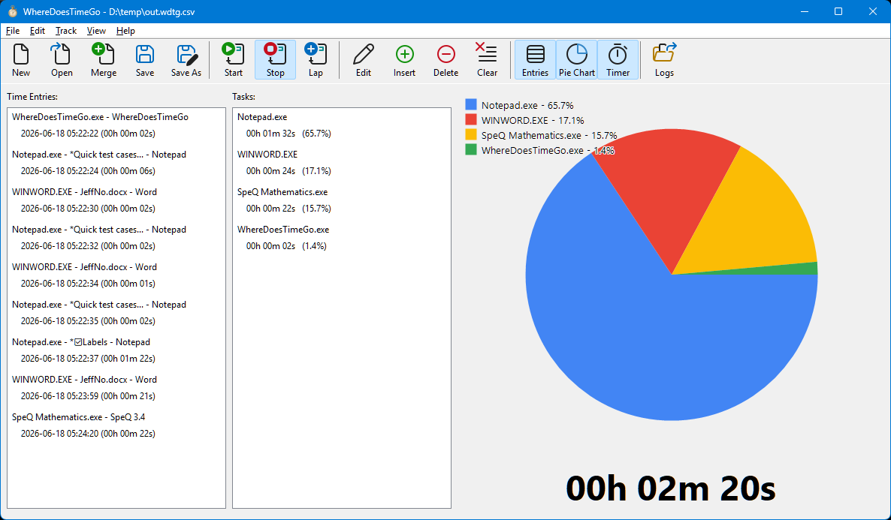
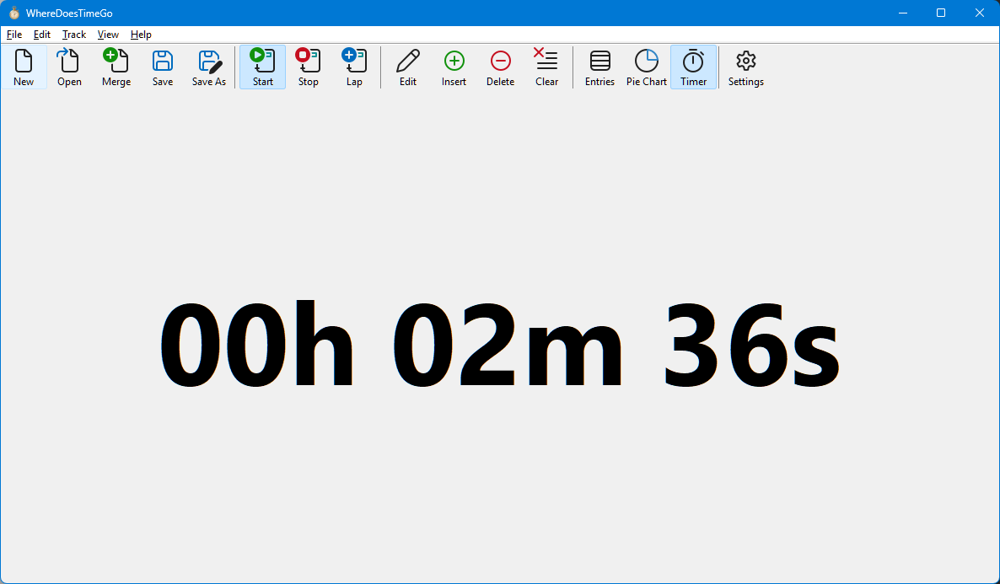
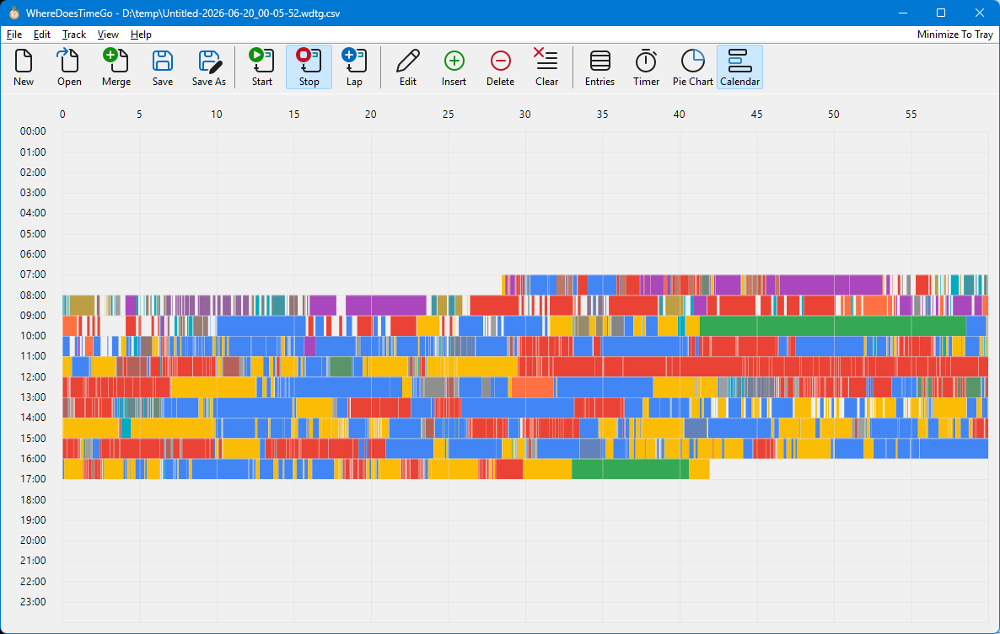

# WhereDoesTimeGo - Windows Time Tracker

This program can record your active window usage and display a pie chart of program usage so you know where you spend your time. I wrote it because every other one I tried didn't do quite what I needed - this is just a simple native Windows app (no bloated Electron app resource hog, no installer needed, no corporate subscription, no background service, no Python or WPF or .NET installation needed...).

    ⏰ A profiler for your life,
    💧 A leak detector for your day,
    🔍 Finding lost hours since 2026.

## Dependencies

Just Windows 7+, x86 or x64 CPU.

## Features

- **Window Time Tracking**: Records active window information (title, process, duration) to a list. Can manually edit entries, like edit "Away" entries to be more specific (e.g. replace "Away" with "Lunch").
- **Pie Chart**: Displays times by percentage.
- **File Saving**: Can save time entries to CSV file and reload/merge them. Can automatically save on exit to avoid losing data because of IT forced updates.
- **Timer**: If you hide the time entries and pie chart, it shows a large timer that shows how long the current session has been.
- **Power Management**: Automatically pauses tracking when machine is locked, sleeps, or hibernates.

## Keyboard Shortcuts
- **Ctrl+N**: Start new session
- **Ctrl+O**: Open CSV file
- **Ctrl+S**: Save to CSV file
- **Ctrl+Alt+S**: Save As
- **Enter/F5**: Start/stop time tracking
- **Escape/F8**: Stops time tracking
- **Delete**: Remove selected time entries
- **F2**/**Double-click**: Edit entry details

## Mouse
- **Hover**/**Left click**: Over pie chart or calendar item to see matching time entry/task. Click to scroll it into view.

## Technical Implementation

- Focus switches are detected with a combination of polling `WM_TIMER` and event hooks via `SetWinEventHook` with `EVENT_SYSTEM_FOREGROUND` (less intrusive than `SetWindowsHookEx`). Each time, `GetSystemTime` is called to log the time.
- The application checks the current window using `GetForegroundWindow` and `GetWindowText`, ignoring little popup dialogs (detected via `GetWindow` with `GW_OWNER`) and retrieving the parent instead.
- The process name is retrieved via `OpenProcess` with `PROCESS_QUERY_LIMITED_INFORMATION` and `QueryFullProcessImageName` rather than `GetModuleFileNameEx` (which purportedly avoids issues 32-bit vs 64-bit processes and has fewer issues with security restrictions). If that can't retrieved, use the window class name as a fallback.
- Any session locks or power management events are detected via `WM_POWERBROADCAST` and `WM_WTSSESSION_CHANGE` messages (enabled by `WTSRegisterSessionNotification` call) so the app can sleep.

## Building

Requires:
- Visual Studio 2022 or later (would probably work with VS 2019 or earlier too, but might need some build tool fixups)
- Windows SDK 10.0 or later
- User32/GDI/GDI+ (included in Windows SDK)

## CSV Format

- Start Time UTC (YYYY-MM-DD HH:MM:SS.mmm) Excel custom format = yyyy-mm-dd hh:mm:ss.000
- End Time UTC (YYYY-MM-DD HH:MM:SS.mmm) Excel custom format = yyyy-mm-dd hh:mm:ss.000
- Process Name
- Window Title (quoted)

## Other Apps

I looked over these - some were closer than others to my needs:

- [Scott W Harden's Active Window Logger](https://github.com/swharden/ActiveWindowLogger) - ✅ no installation needed, simple, logs to CSV. ❌ a little *too* simple, as I can't easily view the data :b.
- [Chinmay TheCodeArtist's Active Window Logger](https://github.com/TheCodeArtist/Active-Window-Logger) - ✅ CSV output ❌ Visual Basic app needing installer.
- [ActivityWatch](https://activitywatch.net/) - ✅ Looks pretty capable. ❌ Heavyweight, web interface (ugh), and background service running.
- [OwlWindowLogger](https://github.com/seanbuscay/owlwindowlogger) - ❌ Python 🐢. Complex setup. No .exe to download, must make yourself. No CSV.
- [WindowsApplicationTracking](https://github.com/natwhite/WindowsApplicationTracking) ✅ sounds useful? ❌ no prebuilt executable to download?
- [Solidtime](https://github.com/solidtime-io/solidtime) - ✅ does a lot of stuff I don't need (billable rates?). ❌ seems to have a subscription plan for professionals.
- [DRYTRIX TimeTracker](https://github.com/DRYTRIX/TimeTracker) - ✅ does a lot of stuff I don't need (generating invoices? client billing?). ❌ Another web interface thing.
- [Tockler](https://tockler.trimatech.dev/) - actually this *might* fit my needs (need to play with it), but I didn't find it until after I wrote this 😅.
- [ProcrastiTracker](https://github.com/aardappel/procrastitracker) - another that might fit my needs, that I didn't find until *after* writing mine 😅.
- [TimeTracker](https://ttracker.sourceforge.net/) [*](https://sourceforge.net/projects/ttracker/) by Roland Bennett ✅ task editing, pie chart, item sorting, CSV export, portable app, tree view ❌ want larger calendar and day view.

## Future Ideas

Note I'm probably not going invest much more into this program (this took 3 days to write), but a few simple things remaining...

- Manual mode when you select a different task to add time entries (like cool ATracker).
- Allow entering custom tasks.
